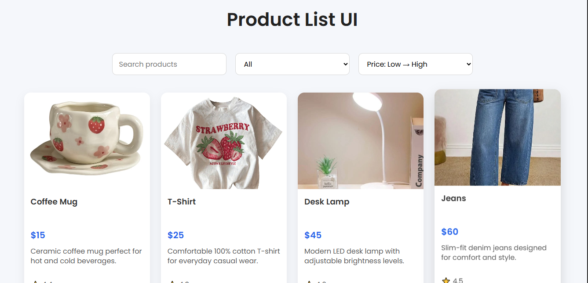

#  Product List UI

A responsive React application that displays products from a local JSON file with powerful search, category filtering, and price sorting functionality.

##  Preview



---

##  Features

- 🔍 Search products by name
- 📂 Filter products by category
- 💲 Sort products by price (Low → High / High → Low)
- 🖼️ Display product images
- ⚡ Optimized rendering using `useMemo`
- 📱 Responsive layout for desktop and mobile devices
- ♻️ Reusable React components

---

##  Built With

- React
- JavaScript (ES6+)
- CSS3
- HTML5
- React Hooks (`useState`, `useMemo`)

---

##  Project Structure

```
src/
├── components/
│   ├── ProductCard.jsx
│   ├── SearchBar.jsx
│   ├── CategoryFilter.jsx
│   └── SortDropDown.jsx
│
├── data/
│   └── products.json
│
├── App.js
├── App.css
└── index.js

public/
└── assets/
    ├── laptop.jpg
    ├── phone.jpg
    └── ...
```

---

##  Getting Started

Clone the repository:

```bash
git clone https://github.com/YOUR_USERNAME/product-list-ui.git
```

Navigate into the project:

```bash
cd product-list-ui
```

Install dependencies:

```bash
npm install
```

Start the development server:

```bash
npm start
```

Open your browser at:

```
http://localhost:3000
```

---

##  Future Improvements

- Add product details page
- Add shopping cart functionality
- Add pagination
- Add dark mode
- Fetch products from an API
- Add product rating filters

---

## 👨‍💻 Author

**Tooba**

Software Engineering Student

---

## ⭐ If you found this project useful, consider giving it a star!